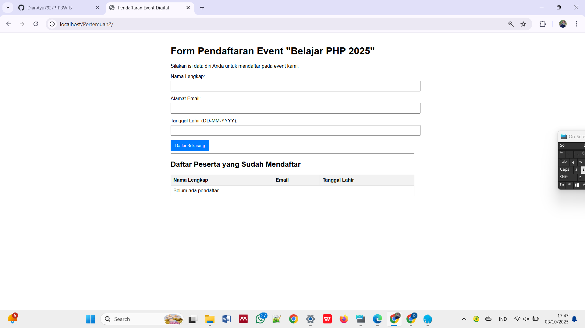
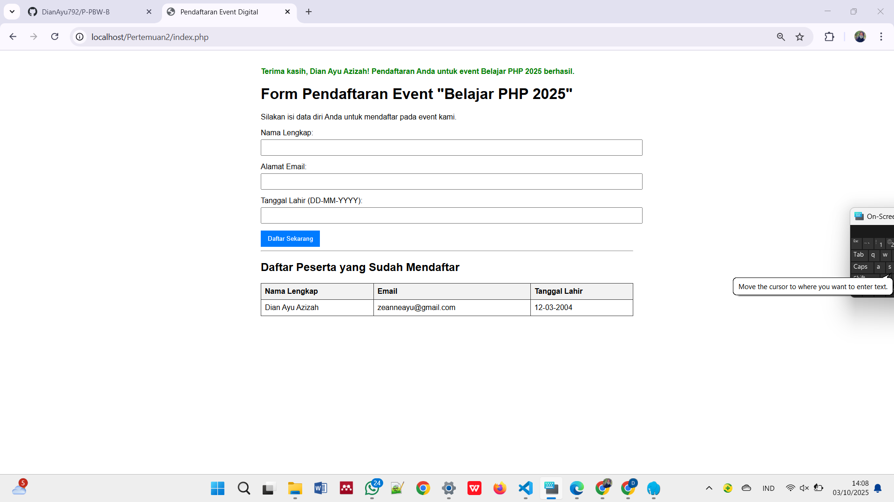
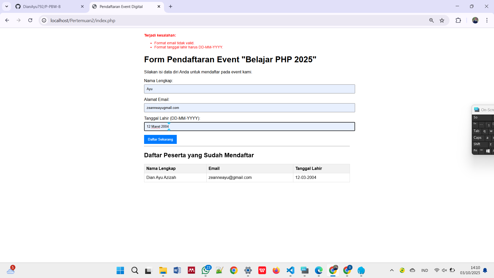

# Praktikum Pertemuan 2: Aplikasi PHP Dasar - Form Pendaftaran Event  

Aplikasi ini dibuat untuk memenuhi tugas praktikum dasar PHP.  
Program ini berupa form pendaftaran sederhana untuk sebuah event fiktif.  

---

## Deskripsi & Fitur  

Aplikasi ini mencakup implementasi beberapa konsep dasar PHP:  

- **Variabel, Global Variabel, dan Konstanta**  
  Digunakan untuk menyimpan data dan konfigurasi.  

- **Fungsi**  
  Membantu modularisasi kode, khususnya untuk validasi input.  

- **Penanganan Form (POST)**  
  Menerima dan memproses data dari form HTML.  

- **Validasi dengan Regex**  
  Memastikan format input email dan tanggal lahir (DD-MM-YYYY) sesuai aturan.  

- **Operasi File**  
  Menyimpan setiap pendaftar yang valid ke dalam file `pendaftar.txt`.  

- **Menampilkan Data**  
  Membaca data dari `pendaftar.txt` dan menampilkannya dalam bentuk tabel.  

---

## Cara Menjalankan  
1. Clone repository ini ke komputer lokal.  
   ```bash
   git clone https://github.com/DianAyu792/P-PBW-B.git
   ```
2. Patikan Laragon sudah aktif.
3. Simpan folder Pertemuan2 ke dalam direktori:
   ```bash
   C:\Program Files\laragon\www\
   ```
4. Jalankan aplikasi dengan cara:
   - Klik Web di panel Laragon, atau
   - Alses melalui browser dengan address:
     ```bash
     http://localhost/Pertemuan2/index.php
     ```

---

## Tampilan Aplikasi  

### Tampilan Awal Form  
*(Letakkan screenshot tampilan form kosong di sini)*  
  

### Tampilan Setelah Pendaftaran Berhasil  
*(Letakkan screenshot setelah berhasil submit data)*  
  

### Contoh Pesan Error Validasi  
*(Letakkan screenshot saat ada error validasi input)*  
  

---

