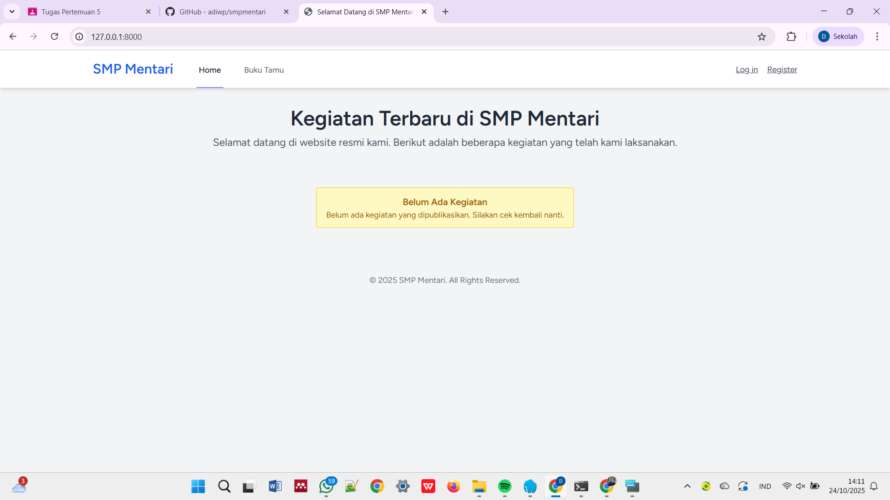
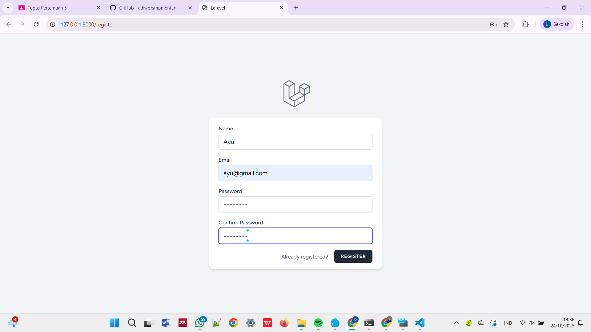
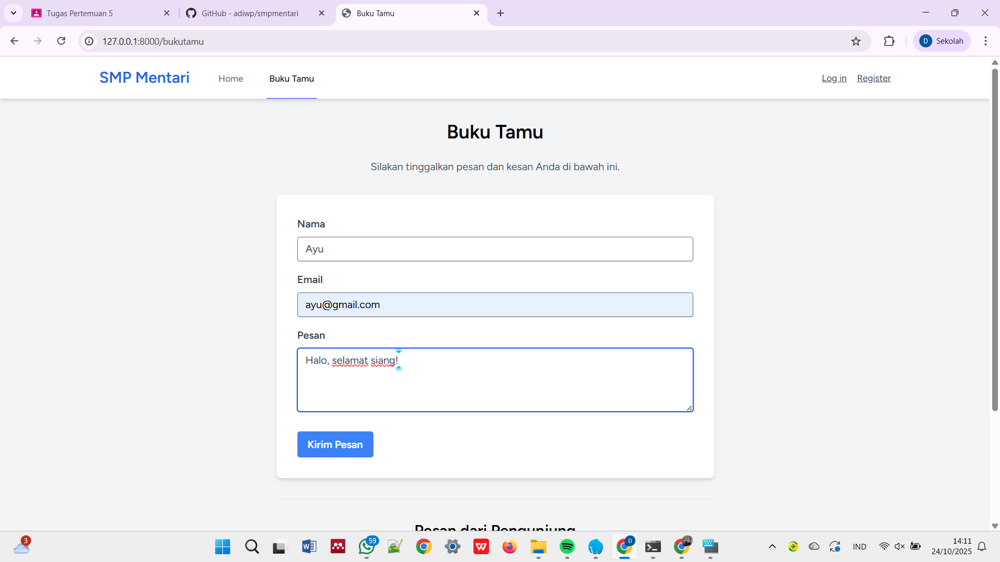
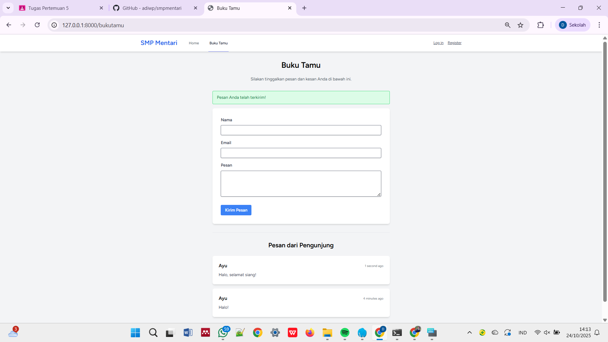
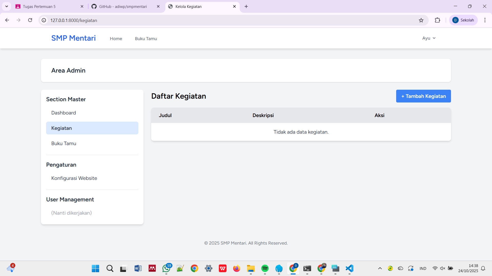
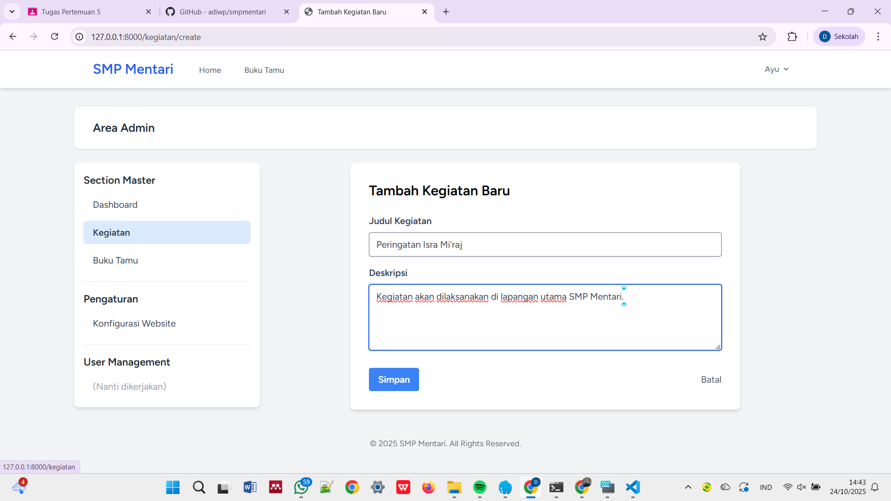
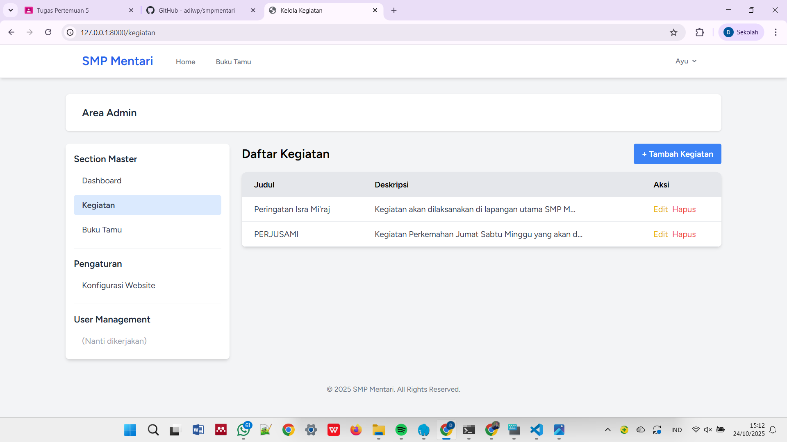
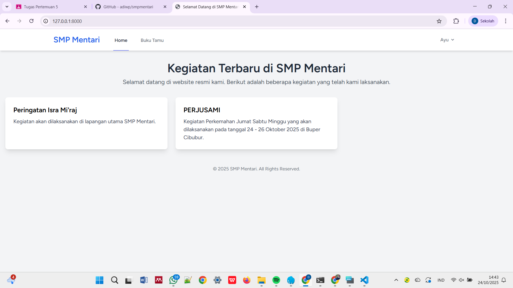

# Proyek Laravel Pertemuan 5 - SMP Mentari

## Identitas Diri
- *Nama : Dian Ayu Azizah*
- *NPM  : 4523210140*

## Deskripsi
Pada pertemuan ke-5 ini, kegiatan yang dilakukan adalah meng-clone aplikasi berbasis web dari sebuah repository GitHub ke device lokal, kemudian menjalankan aplikasinya menggunakan Laragon (MySQL + PHP).

## Langkah-Langkah:
1. Clone Repository: 
   
   ```bash
   git clone https://github.com/adiwp/smpmentari.git
   cd smpmentari
   ```
2. Install Dependencies:
   
   ```bash
   composer install
   npm install
   ```

3. Setup Environtment:
   
   ```bash
   cp .env.example .env
   php artisan key:generate
   ```

4. Setup Database:
   
   ```bash
   php artisan migrate
   ```

5. Build Assets:
   
   ```bash
   npm run dev
   npm run build
   ```

6. Jalankan Aplikasi:
   
   ```bash
   php artisan serve
   ```
 
## Tampilan Aplikasi 

Tampilannya sebagai berikut:
1. Home Page


2. Register Page
 

3. Buku Tamu Page
    

4. Pesan Sukses Dikirim
       

5. Kegiatan Page
       

6. Tambah Kegiatan Page
       

7. Tampilan Setelah Tambah Kegiatan
       

8. Home Page Setelah Update
    