# Proyek Laravel Pertemuan 6 - SMP Mentari dengan Filament

## Identitas Diri
- *Nama : Dian Ayu Azizah*
- *NPM  : 4523210140*

## Deskripsi
Pada pertemuan ke-6 ini, kegiatan yang dilakukan adalah membuat aplikasi maanjemen sekolah SMP Mentari menggunakan Filament sebagai admin panel. Filament merupakan tools untuk membangun admin panel yang modern dan user friendly dalam environtment Laravel.

## Tools
1. Laravel 12 - PHP Framework
2. Filament v4 - Admin Panel
3. MySQL - Database
4. Laragon
5. Visual Studio Code

## Langkah-Langkah
1. Buat proyek kosong
   
   ```bash
   composer create-project laravel/laravel smpmentari_filament

   cd smpmentari_filament
   ```
2. Konfirgurasi Database (MySQL - Laragon)
   - setting .env
   ```bash
   DB_CONNECTION=mysql 
   DB_HOST=127.0.0.1 
   DB_PORT=3306 
   DB_DATABASE=smpmentari_filament 
   DB_USERNAME=root 
   DB_PASSWORD= 
   ```
   - migrasi awal
   ```bash
   php artisan migrate
   ```

3. Install Filament v4 (Admin Panel)
   - pasang paket filament v4
   ```bash
   composer require filament/filament:"^4.0"
   ```
   - generate panel admin
   ```bash
   php artisan filament:install -- panels

   what is the panels ID? (admin)
   ```
   - buat akun admin filament
   ```bash
   php artisan make:filament-user
   name : admin
   email : admin@example.com
   pw : admin123
   ```
   - link storage untuk up file
   ```bash
   php artisan storage:link
   ```

4. Desain Data Minimal (Tema SMP Mentari)
   - buat model + migrasi
   ```bash
   php artisan make:model Kegiatan -m
   php artisan make:model Siswa -m
   ```
   - jalankan migrasi
   ```bash
   php artisan migrate
   ```

5. Generate Filament Resourdce (auto CRUD)

   - kegiatan
   ```bash
   php artisan make:filament-resource Kegiatan --generate

   Models : name
   View only : no
   ```
   - siswa
   ```bash
   php artisan make:filament-resource Siswa --generate

   Models : name
   View only : no
   ```

6. Branding Panel: Identitas SMP Mentari
   - app/Provides/Filament/AdminPanelProvider.php setting
   ```bash
   ->brandName('SMP Mentari')
   ->navigationGroups('Akademik', 'Publikasi')
   ->sidebarCollapsideOnDesktop(true)
   ```

7. Halaman Depan (Public) Simple
   - routes/web.php set
   ```bash
   Route::view('/', 'welcome'); 
   Route::get('/kegiatan', function () { 
   return view('kegiatan-public', [ 
   'items' => \App\Models\Kegiatan::latest()->paginate(9), 
   ]); 
   }); 
   ```
   - add resource/views/kegiatan-public.blade.php
   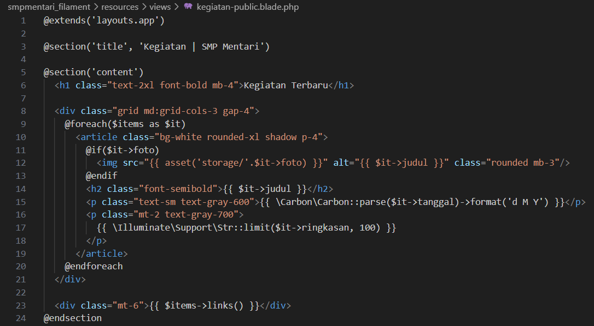
   
   - add resource/views/layouts/app.blade.php
   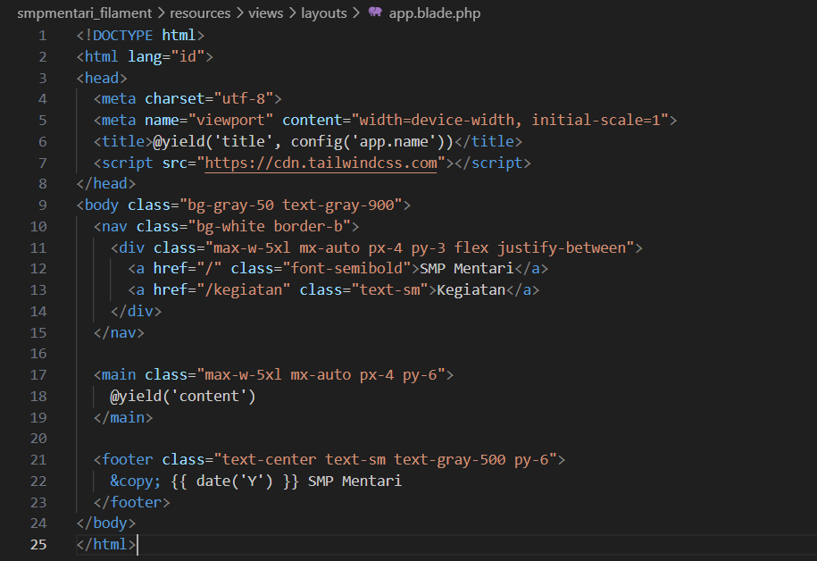

8. Jalankan Aplikasi
   ```bash
   php artisan serve
   ```
   - Admin: http://localhost:8000/admin
   - Publik: http://localhost:8000/kegiatan
 
## Tampilan Aplikasi 

Tampilannya sebagai berikut:
1. Login
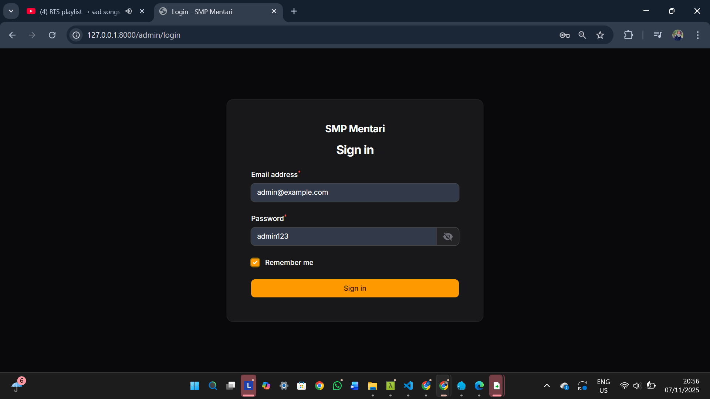

2. Dashboard Admin
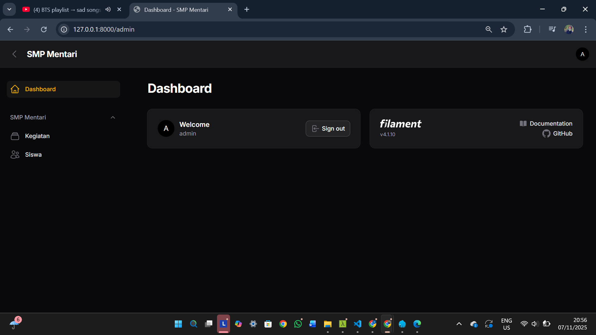 

3. Halaman Kegiatan
   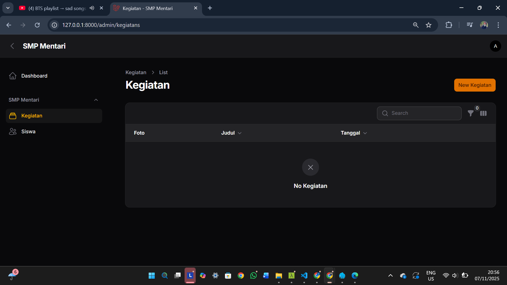 

4. Halaman Create Kegiatan
      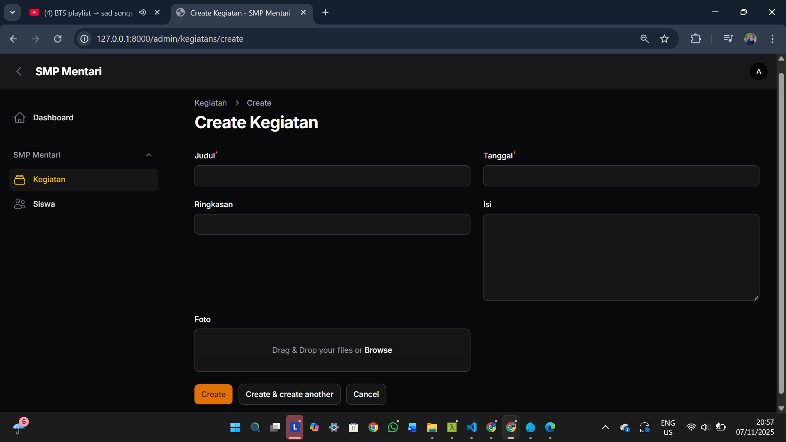 
      

5. Halaman Edit Kegiatan
       

6. Pop-up Delete Kegiatan
      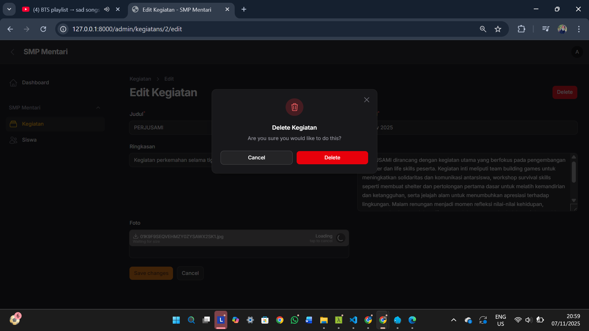 

7. Halaman Kegiatan (Update)
      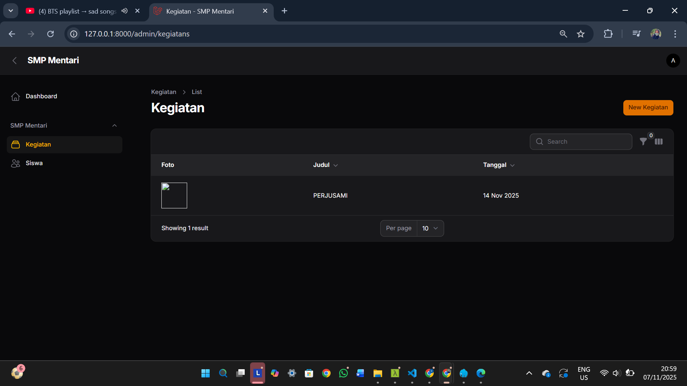 

8. Halaman Siswa
      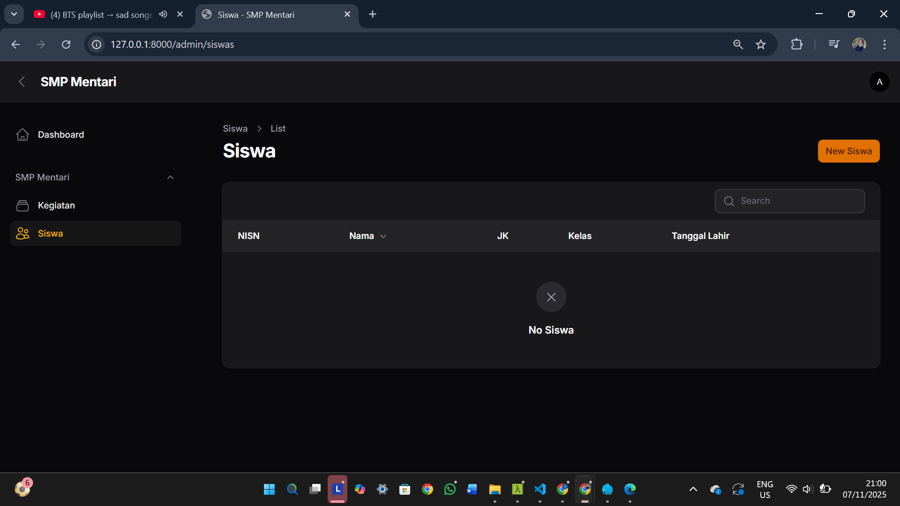 

9. Halaman Create Siswa
   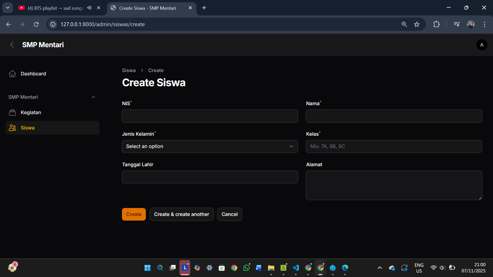 
    

10. Halaman Edit Siwa
      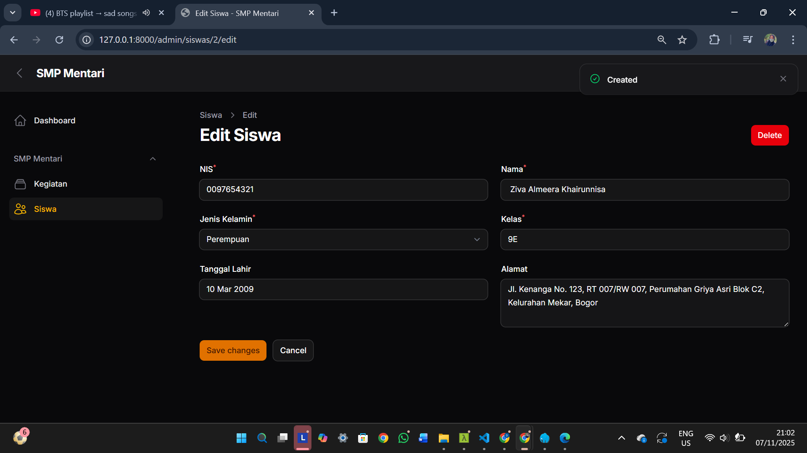 

11. Halaman Delete Siwa
      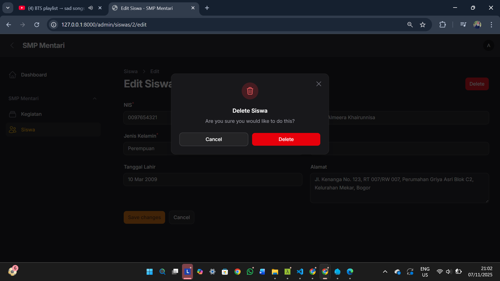 

12. Halaman Siswa (Update)
      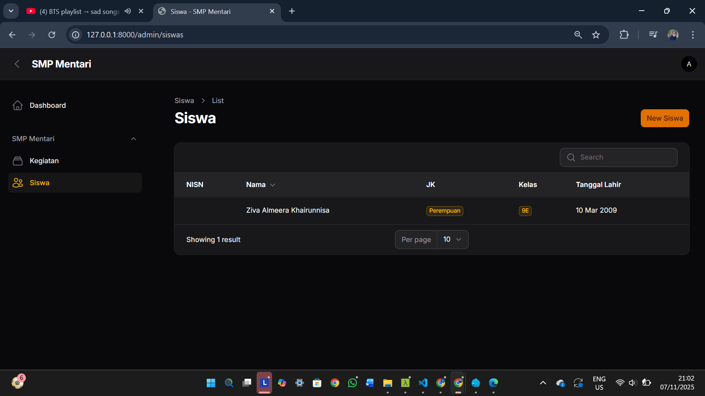 
   